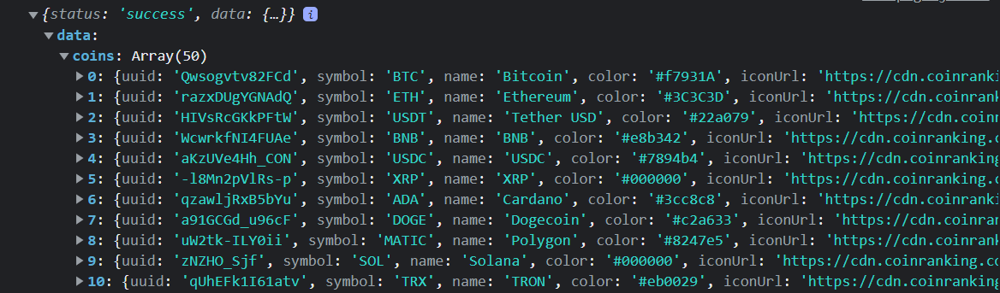

<h1>Cryptocurrency API App</h1>
<p><i>Tutorial Provided By: <a href="https://www.youtube.com/watch?v=GDa8kZLNhJ4&t=23390s&ab_channel=JavaScriptMastery">JavaScript Mastery</a></i></p>

<br/>
*
<br/>
*
<br/>
*
<br/>
<br/>

<h2><b>About</b></h2>

<p>This app features the <a href="https://rapidapi.com/Coinranking/api/coinranking1">Coinranking API</a> and <a href="https://rapidapi.com/microsoft-azure-org-microsoft-cognitive-services/api/bing-news-search1/">Bing News Search API</a> from <a href="https://rapidapi.com/hub">Rapid API</a> and also uses the following tools:</p>

<br/>

|                    <b>FEATURES</b>                    |                                                  <b>DESCRIPTIONS</b>                                                  |
| :---------------------------------------------------: | :-------------------------------------------------------------------------------------------------------------------: |
|       <a href="https://redux.js.org/">Redux</a>       |                                       A predictable state container for JS Apps                                       |
| <a href="https://axios-http.com/docs/intro">Axios</a> |                                A promise-based HTTP Client for node.js and the browser                                |
|     <a href="https://ant.design/">Ant Design</a>      | Provides plenty of UI components to enrich your web applications, and will improve components experience consistently |
|      <a href="https://momentjs.com/">Moment</a>       |                                                 Time & Date Formatter                                                 |
| <a href="https://npm.io/package/millify">Millify</a>  |                               Converts long numbers into pretty, human-readable strings                               |
|    <a href="https://www.chartjs.org/">Chart.js</a>    |                          Simple yet flexible JavaScript charting library for the modern web                           |

<br/>
*
<br/>
*
<br/>
*
<br/>
<br/>

<p>Although I used Redux to make my API calls, you can simply use Axios to test whether you're receiving the data:</p>

> <i><b>NOTE:</b> You must create an account at Rapid API in order to receive an API key.</i>

```js
import axios from "axios";
// NOTE: All .env variables here are provided by the Rapid API website after creating an account

const getCoinData = async () => {
  const options = {
    params: {
      referenceCurrencyUuid: "yhjMzLPhuIDl",
      timePeriod: "24h",
      "tiers[0]": "1",
      orderBy: "marketCap",
      orderDirection: "desc",
      limit: "50",
      offset: "0",
    },
    headers: {
      "X-RapidAPI-Key": process.env.REACT_APP_RAPIDAPI_KEY,
      "X-RapidAPI-Host": process.env.REACT_APP_RAPIDAPI_HOST,
    },
  };

  const data = await axios.get(process.env.REACT_APP_RAPIDAPI_URL, options);

  console.log(data.data); // receives all coins
  console.log(data.data.stats); // receives all stats
};
```

<br/>

<h3><b>Results</b></h3>

<code>console.log(data.data)</code>



<br/>

<code>console.log(data.data.stats)</code>


<p><b><i>data.data.stats</i></b> is the data obtained and used for the Global Crypto Stats section. Upon inspecting the source code, you will notice that <b><i>millify</i></b> helps condense larger numbers to reader-friendly format (compare the compare the numerical value of the data results in the image above with the rendered numbers in the image below).</p>


<br/>

<h3><b>Example Using Redux</b></h3>

<code>services/cryptoAPI.js</code>

```js
import { createApi, fetchBaseQuery } from "@reduxjs/toolkit/query/react";

const cryptoApiHeaders = {
  "X-RapidAPI-Key": process.env.REACT_APP_RAPIDAPI_KEY,
  "X-RapidAPI-Host": process.env.REACT_APP_RAPIDAPI_HOST,
};

const createRequest = (url) => ({ url, headers: cryptoApiHeaders });

export const cryptoApi = createApi({
  reducerPath: "cryptoApi",
  baseQuery: fetchBaseQuery({
    baseUrl: process.env.REACT_APP_CRYPTO_API_URL,
  }),
  endpoints: (builder) => ({
    getCryptos: builder.query({
      query: (count) => createRequest(`coins?limit=${count}`),
    }),
    getCryptoDetails: builder.query({
      query: (coinId) => createRequest(`coin/${coinId}`),
    }),
    getCryptoHistory: builder.query({
      query: ({ coinId, timeperiod }) =>
        createRequest(`coin/${coinId}/history?timePeriod=${timeperiod}`),
    }),
  }),
});

export const {
  useGetCryptosQuery,
  useGetCryptoDetailsQuery,
  useGetCryptoHistoryQuery,
} = cryptoApi;
```

<ul>
<li><b>createApi:</b> Define endpoints and how data should be manipulated &#40;learn more <a href="https://redux-toolkit.js.org/rtk-query/api/createApi">here</a>&#41;</li>
<li><b>fetchBaseQuery:</b> RTK Query's simplified HTTP request handler &#40;learn more <a href="https://redux-toolkit.js.org/rtk-query/api/fetchBaseQuery">here</a>&#41;</li>
</ul>

<br/>

<h3><b><i>How Does It Communicate and Interact With The App?</i></b></h3>
<p>Create a store and pass in API's and middleware functions. <a href="https://redux-toolkit.js.org/api/configureStore">Learn</a> about <b><i>configureStore</i></b>.</p>

<code>app/store.js</code>

```js
import { configureStore } from "@reduxjs/toolkit";
import { cryptoApi } from "../services/cryptoAPI";
import { cryptoNewsApi } from "../services/cryptoNewsAPI";

export default configureStore({
  reducer: {
    [cryptoApi.reducerPath]: cryptoApi.reducer,
    [cryptoNewsApi.reducerPath]: cryptoNewsApi.reducer,
  },
  middleware: (getDefaultMiddleware) =>
    getDefaultMiddleware()
      .concat(cryptoApi.middleware)
      .concat(cryptoNewsApi.middleware),
});
```

<br/>

<p>Import <b><i>Provider</i></b> and pass the <b><i>store</i></b> as a parameter. Wrap around the entire app in order to make it available to all components.</p>

<code>index.js</code>

```js
import React from "react";
import ReactDOM from "react-dom/client";
import App from "./App";
import { BrowserRouter as Router } from "react-router-dom";
import "antd/dist/reset.css";

// import Provider and store
import { Provider } from "react-redux";
import store from "./app/store";

const root = ReactDOM.createRoot(document.getElementById("root"));
root.render(
  <Router>
    <Provider store={store}>
      <App />
    </Provider>
  </Router>
);
```

<br/>

<p>Import <b><i>useGetCryptosQuery</i></b> to access and use the HTTP request.</p>

<code>components/Homepage.jsx</code>

```jsx
import { useGetCryptosQuery } from "../services/cryptoAPI";

const Homepage = () => {
  const { data, isFetching } = useGetCryptosQuery(10);

  // ... code ...
};

export default Homepage;
```

<ul>
<li><code>components/Homepage.jsx</code> &rArr; <b>useGetCryptosQuery</b> is called with a parameter of <b>10</b></li>
<li><code>services/cryptoAPI.js</code> &rArr; <b>getCryptos</b> takes the parameter and passes it into a custom utility function that creates a specified request. In this case,</li>

```js
const cryptoApiHeaders = {
  "X-RapidAPI-Key": process.env.REACT_APP_RAPIDAPI_KEY,
  "X-RapidAPI-Host": process.env.REACT_APP_RAPIDAPI_HOST,
};

const createRequest = (url) => ({ url, headers: cryptoApiHeaders });

getCryptos: builder.query({
      query: (count) => createRequest(`coins?limit=${count}`),
    }),
```

> <i><b>NOTE:</b> <b>url</b> will be concatenated to the <b>baseUrl</b> defined in <b>fetchBaseQuery</b>.</i>

</ul>

<br/>

<p>This same process occurs with fetching the news API as well:</p>

<code>services/cryptoNewsAPI.js</code>

```js
import { createApi, fetchBaseQuery } from "@reduxjs/toolkit/query/react";

const cryptoNewsApiHeaders = {
  "X-BingApis-SDK": "true",
  "X-RapidAPI-Key": process.env.RAPIDAPI_KEY,
  "X-RapidAPI-Host": process.env.BING_NEWS_HOST,
};

const createRequest = (url) => ({ url, headers: cryptoNewsApiHeaders });

export const cryptoNewsApi = createApi({
  reducerPath: "cryptoNewsApi",
  baseQuery: fetchBaseQuery({
    baseUrl: process.env.BING_NEWS_URL,
  }),
  endpoints: (builder) => ({
    getCryptoNews: builder.query({
      query: ({ newsCategory, count }) =>
        createRequest(
          `news/search?q=${newsCategory}&safeSearch=Off&textFormat=Raw&freshness=Day&count=${count}`
        ),
    }),
  }),
});

export const { useGetCryptoNewsQuery } = cryptoNewsApi;
```

<br/>

<h3><b>Chart.js</b></h3>

<p>This component renders charts for each cryptocurrency. The <b>&#60;Title&#62;</b> elements render the chart headings and the actual chart is rendered by the <b>&#60;Line&#62;</b> element. <a href="https://www.chartjs.org/docs/latest/charts/line.html">Read more</a> about <b>&#60;Line&#62;</b>.

<code>components/LineChart.jsx</code>

```js
import React from "react";
import { Line } from "react-chartjs-2";
import { Col, Row, Typography } from "antd";
import {
  Chart as ChartJS,
  LineElement,
  CategoryScale,
  LinearScale,
  PointElement,
  Legend,
} from "chart.js";

ChartJS.register(LineElement, CategoryScale, LinearScale, PointElement, Legend);

const { Title } = Typography;

const LineChart = ({ coinHistory, currentPrice, coinName }) => {
  const coinPrice = [];
  const coinTimestamp = [];

  if (coinHistory?.data?.history) {
    for (let i = 0; i < coinHistory.data.history.length; i++) {
      coinPrice.push(coinHistory.data.history[i].price);
    }

    for (let i = 0; i < coinHistory.data.history.length; i++) {
      coinTimestamp.push(
        new Date(
          coinHistory.data.history[i].timestamp * 1000
        ).toLocaleDateString()
      );
    }
  }

  const data = {
    labels: coinTimeStamp,
    datasets: [
      {
        label: "Price In USD",
        data: coinPrice,
        backgroundColor: "#0071bd",
        borderColor: "#0071bd",
      },
    ],
  };

  return (
    <>
      <Row className="chart-header">
        <Title level={2} className="chart-title">
          {coinName} Price Chart{" "}
        </Title>
        <Col className="price-container">
          <Title level={5} className="price-change">
            Change:{" "}
            {coinHistory?.data?.change < 0 ? (
              <span style={{ color: "red" }}>{coinHistory.data.change}%</span>
            ) : coinHistory?.data?.change > 0 ? (
              <span style={{ color: "green" }}>{coinHistory.data.change}%</span>
            ) : null}
          </Title>
          <Title level={5} className="current-price">
            Current {coinName} Price: ${" "}
            <span style={{ color: "#0066AC" }}>{currentPrice}</span>
          </Title>
        </Col>
      </Row>
      <Line data={data} options={options} />
    </>
  );
};

export default LineChart;
```

<br/>

<h3><b><i>How Does Chart.js Work?</i></b></h3>
<p>First, import and register the elements you need to use:</p>

<code>components/LineChart.jsx</code>

```js
// ... other imports
import { Line } from "react-chartjs-2";
import {
  Chart as ChartJS,
  LineElement,
  CategoryScale,
  LinearScale,
  PointElement,
  Legend,
} from "chart.js";

ChartJS.register(LineElement, CategoryScale, LinearScale, PointElement, Legend);
```

<br/>

<p>Create arrays for your datasets and define the data and options you want to pass to the <b>&#60;Line&#62;</b> element. In this case, <b><i>labels &#40;x-axis&#41;</i></b> will be populated by the <b>coinTimestamp</b> array and the <b><i>data &#40;y-axis&#41;</i></b>, within <b><i>datasets</i></b>, will be populated by the <b>coinPrice</b> array. For this particular chart, no additional or custom options are necessary.</p>

```js
const data = {
  labels: coinTimestamp,
  datasets: [
    {
      label: "Price In USD",
      data: coinPrice,
      backgroundColor: "#0071bd",
      borderColor: "#0071bd",
    },
  ],
};
```

<br/>


